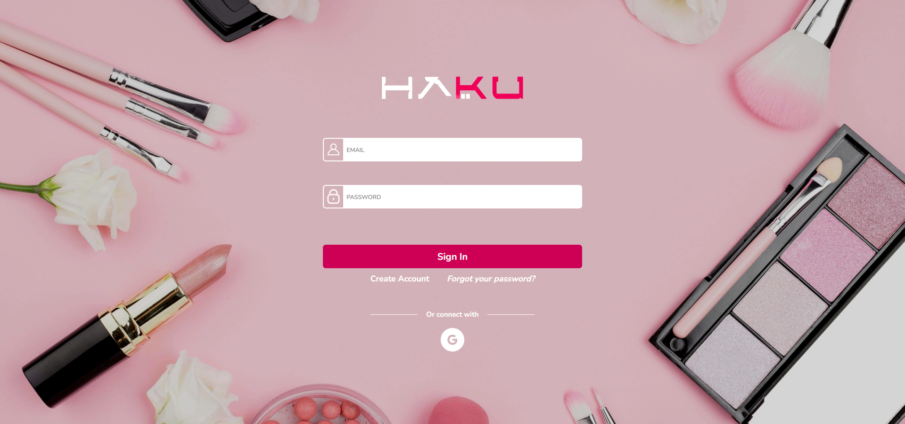

# "HAKU"

## Índice

* [1. Definición del Proyecto](#1-definición-del-proyecto)
* [2. Investigación UX](#2-investigación-ux)
* [3. Diseño UI](#3-diseño-ui)
* [4. Interfaz de Usuario](#4-interfaz-de-usuario)

## 1. Definición del Proyecto

Haku es una página web SPA (Single Page Aplication) desarrollada con Firebase. Es una red social para todas las personas
que les interese o esten iniciando en el mundo de la belleza, en la cual les permitirá compartir experiencias, consejos,
marcas de productos,etc. Las principales funcionalidades incluyen: inicio de sesión automático con Google, publicación de información
y eliminación de publicaciones existentes. Es adaptable a cualquier dispositivo.

## 2. Investigación UX

### 2.1 ¿Quiénes son los principales usuarios de producto?
Son personas que estan en el rubro de la belleza, también para las personas con un alto o pequeño interés en la belleza
en la cual quieran compartir experiencias vividas, consejos de cabello, piel, uñas, etc. Está dirigido a personas adultas
y jóvenes.

### 2.2 ¿Qué problema resuelve el producto / para qué le servirá a estos usuarios?
Poder obtener conocimientos para el cuidado de uno mismo(a), desarrollar experticia o ampliar conocimientos,
poder encontrar otros intereses en este rubro, poder compartir con otras personas con el mismo interés o alguien que se
este adentrando por primera vez al mundo de la belleza.

## 3. Diseño UI

### 3.1 Historias de Usuario

#### Historia Uno
- Yo cómo: Usuaria que le gusta el rubro de la belleza.
- Quiero: Poder acceder automáticamente con mi cuenta vinculada en Google.
- Para: Ingresar a la red de manera rápida.
- Criterios de Aceptación:
    - Que pueda crear su cuenta a través de cuenta de Google.
    - Debe haber una opción para iniciar sesión.
    - Al iniciar con Google, deberá ser redirigido a la página de autenticación de Google.
    - Despues de la autenticación, debe ser redirigida a los post de usuarios.
- Definición de Terminado:
    - Insertar un icono de Google.
    - Debe ser un SPA.
    - Debe ser responsive.

#### Historia Dos
- Yo cómo: Estilista de cabello.
- Quiero: Porder publicar información sobre tips de belleza.
- Para: Compartir conocimientos y dar consejos.
- Criterios de Aceptación:
    - Espacio para escribir el post.
    - Poder publicar el post al muro.
    - Poder cancelar la publicación.
    - Debe ser un SPA.
    - Debe ser responsive.

- Definición de Terminado:
    - Definir un espacio para escribir el texto.
    - Recargar la página y se mantenga el post.

#### Historia Tres
- Yo cómo: Maquilladora.
- Quiero: Poder eliminar mis publicaciones existentes.
- Para: Deshacerme de los que ya no sean resaltantes.
- Criterios de Aceptación:
    - Clickear un botón de "Eliminar".
    - Al clickear debe lograr eliminar el post personal.
    - Debe ser un SPA.
    - Debe ser responsive.

- Definición de Terminado:
    - Al recargar la página no debe aparecer el post eliminado.

#### Historia Cuatro
- Yo cómo: Colorista de cabello.
- Quiero: Editar mis publicaciones.
- Para: Poder corregir en caso haya un error ortográfico o complementar al contenido publicado.
- Criterios de Aceptación:
    - Clickear un botón de "Editar".
    - Al clickear poder editar el texto.
    - Poder guardar el texto modificado.
    - Debe ser un SPA.
    - Debe ser responsive.
- Definición de Terminado:
    - Debe cambiar el texto por un input que permita editar el texto.
    - Presencia de un botón para guardar cambios.
    - Guardar los cambios.
    - Visualizar la información editada.
    - Al recargar la página debo de poder ver los textos editados en el muro.

#### Historia Cinco
- Yo cómo: Manicurista.
- Quiero: Poder dar like a una publicación.
- Para: Indicar lo que me gusta.
- Criterios de Aceptación:
    - Dar like a un publicación.
    - Debe ser un SPA.
    - Debe ser responsive.
- Definición de Terminado:
    - Clickear la palabra 'like'.
    - Al recargar la página, debe mantener el like.
    - Se mostrará la cantidad de likes.

### 3. Prototipo de alta fidelidad
[Link al prototipo interactivo de Figma](https://www.figma.com/proto/xc2NclqbeAF00eKW8JqvP4/Red-Social?type=design&node-id=122-145&t=SLn8Bczka9LtYn2N-0&scaling=scale-down&page-id=0%3A1&starting-point-node-id=122%3A145)

## 4. Interfaz de Usuario

### Desktop
 

 

 

### Mobile
